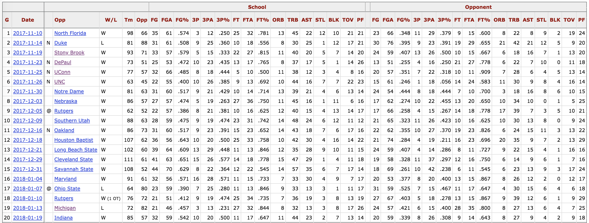
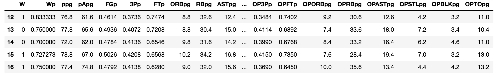
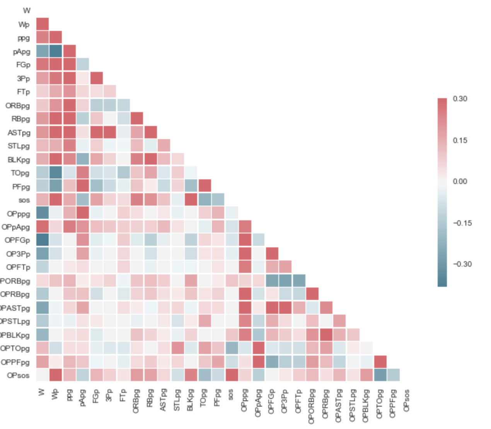
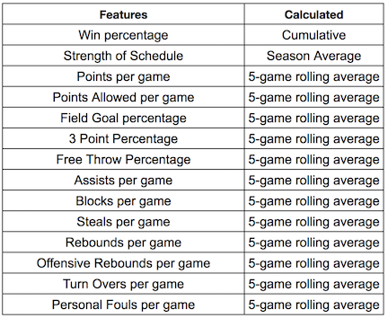
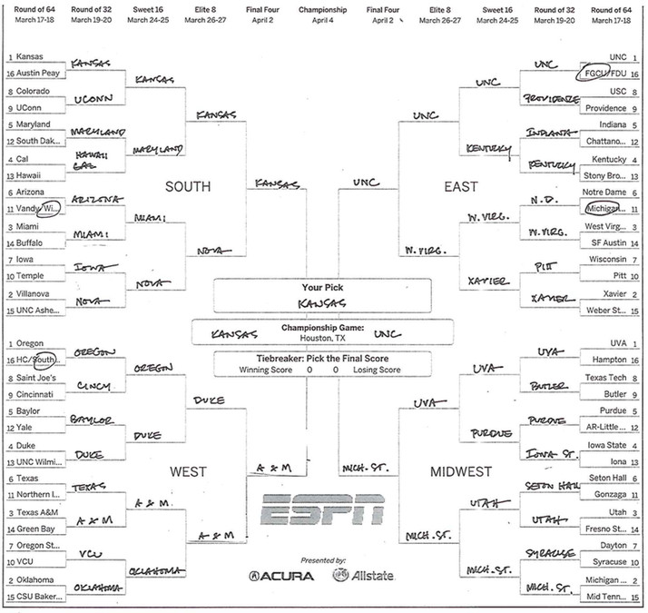
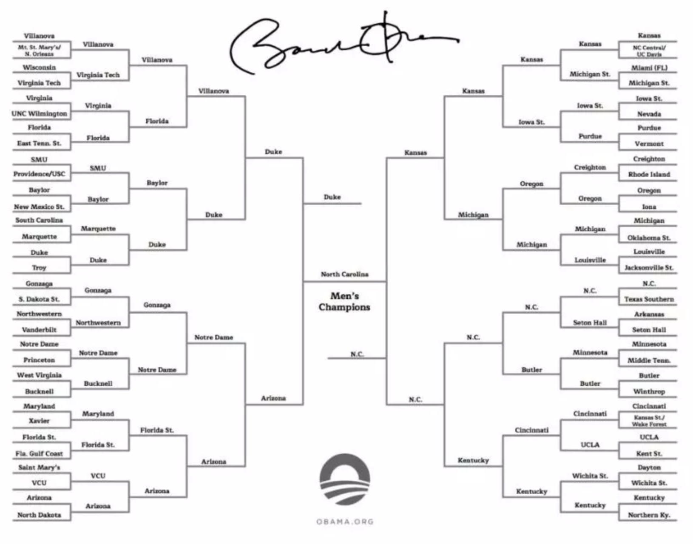

# Bracket Buster

<!--  -->


## Table of Contents
1. [Dataset](#dataset)
    * [Pre-Processing](#Pre-processing)
3. [Modeling](#Modeling)
4. [Pick a winner](#Pick-a-winner-feature)
5. [Brackets](#Brackets)
    * [2016 Bracket](#2016-Bracket)
    * [2017 Bracket](#2017-Bracket)


## Hypothesis
- Using logistic regression I can create a model to predict winners that can build a better bracket than Obama

## Dataset
Gamelogs for each team from the past 5 years. Retrieved from www.sports-reference.com.



### Pre-processing

[code_link](game_df_creator.py)

Data Cleaning:



  - Downloaded game data for all teams from 2013 to 2016 (over 4886 games)
  - Feature Engineering:
    - Current win percentage
     - Rolling average Features:
        - Points per game,
        - Points against per game,
        - Field goal percentage,
        - free throw percentage,
        - three-point percentage,
        - rebounds per game,
        - offensive rebounds per game,
        - assist per game,
        - blocks per game,
        - steals per game,
        - turn overs per game
        - personal fouls per game
  - Also added Strength of Schedule (only 2018 season...)
  - generate a unique id by mapping names with formatted names
  - combine data to one row for each match!



Hard to tell which features are most important based on visual inspection.  So I wanted to use regularization to help pick.  

Turns out logistic regression uses Ridge regularization by default.  

## Modeling
**Basic Logistic Regression**

* Trained and tested on data from games form 2013 to 2017
  * using basic train test split on randomized data
```
Accuracy: 0.79 (% predicted correctly)
Precision: 0.78 (predicted positives % correct)
Recall: 0.79 (% of positives predicted correctly)
f1 Score: 0.79 (weighted average of Precision and Recall)
```

* Trained on data from games form 2013 to 2017
* Tested on 2018 games

```
Accuracy: 0.78 (% predicted correctly)
Precision: 0.78 (predicted positives % correct)
Recall: 0.77 (% of positives predicted correctly)
f1 Score: 0.78 (weighted average of Precision and Recall)
```


**Coefficients**



To Do:
- cross-validation and C optimization

- C optimization plots

- ROC curve and threshold optimization

## Pick-a-winner-feature

- Use optimized model to predict matches!
- create a function to take two teams and pit them against each other
- fill out a bracket for the 2016 tournament and see if I can beat Obama


For Tourney:
- get each teams final game in dataframe
- create function to pit two teams against each other and predict
- team 1 wins or loses when against team 2

## Brackets

**Bracket point system:**
- Round 1 (64 teams): 1 point per pick
- Round 2 (32 teams): 2
- Round 3 (16 teams): 4
- Round 4 (8 teams): 8
- Round 5 (Final Four): 16
- Round 6 (Championship): 32

### 2016-Bracket



Update with my predictions and calculated scores

- ‎sean: points
- ‎obama: points

### 2017-Bracket




## Learned-
- Pandas, Pandas, Pandas
 - .rolling, .cumsum
 - ‎def function(row): df.apply( thanks michael
 - ‎mapping with dictionaries
 - worked through ‎a lot of problems


 notes:
 interesting about data
 what model did i choose
 how did i decide on complexity


- test on 2017 season
  - set up test train split on season data
    - using tournament as test set
  - Use KFolds to train model with LogisticRegression
  - How does it do?
- Implement on 2018
  - fill out bracket

create dfs with all tourney teams final stats for

- Run on each rounds matchups
- Use to fill out bracket!


Jokes:
- any sports fans out there? No... Well I'm gonna do this anyway
- scatter matrix and correlation matrix
  - What am I supposed to make form these?
  - I am supposed to pick my own features?
  - I came here to teach robots to learn.
  - So when the singularity comes they will call me master

<!--  -->


Future:
- ‎lag on rolling aves
- ‎sos for each year and possibly rolling
- ‎other features: pace, stats per 100 possessions, team makeup, offensive rating, defensive rating
- ‎map all team names back to common formatting
