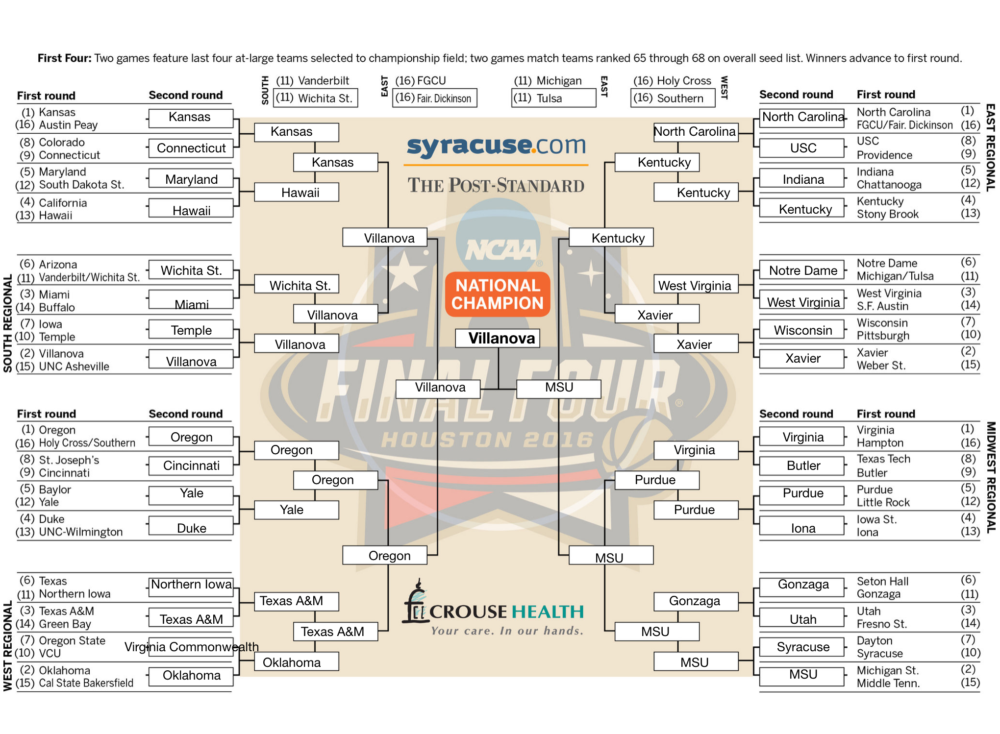
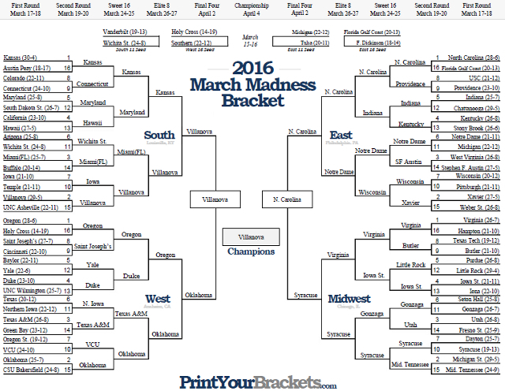

# Bracket Buster


## Table of Contents
1. [Dataset](#dataset)
    * [Pre-Processing](#Pre-processing)
3. [Modeling](#Modeling)
4. [Pick a winner](#Pick-a-winner-feature)
5. [Brackets](#Brackets)
    * [2016 Bracket](#2016-Bracket)
    * [2017 Bracket](#2017-Bracket)


## Hypothesis
- Using logistic regression I can create a model to predict winners that can build a better bracket than Obama

## Dataset
Gamelogs for each team from the past 5 years. Retrieved from www.sports-reference.com.


### Pre-processing

[code_link](game_df_creator.py)

Data Cleaning:


  - Downloaded game data for all teams from 2013 to 2016 (over 4886 games)
  - Feature Engineering:
    - Current win percentage
     - Rolling average Features:
        - Points per game,
        - Points against per game,
        - Field goal percentage,
        - free throw percentage,
        - three-point percentage,
        - rebounds per game,
        - offensive rebounds per game,
        - assist per game,
        - blocks per game,
        - steals per game,
        - turn overs per game
        - personal fouls per game
  - Also added Strength of Schedule (only 2018 season...)
  - generate a unique id by mapping names with formatted names
  - combine data to one row for each match!


Hard to tell which features are most important based on visual inspection.  So I wanted to use regularization to help pick.  

Turns out logistic regression uses Ridge regularization by default.  

## Modeling

**Logistic Regression**

* Turns out LogisticRegression uses Ridge regularization by default and can be switched to Lasso with an argument.  In this case there was not a significant difference between the two.
  * penalty='l2'  -->   Ridge
  * penalty='l1'  -->   Lasso

* Trained and tested on data from games form 2013 to 2017
  * using 5-fold cross validation on shuffled data

```
Accuracy: 0.79 (% predicted correctly)
Precision: 0.78 (predicted positives % correct)
Recall: 0.79 (% of positives predicted correctly)
f1 Score: 0.79 (weighted average of Precision and Recall)
```

* Trained on data from games form 2013 to 2017
  * Tested on 2018 games
  * I guessed 80% of the games right?!

```
Accuracy: 0.78 (% predicted correctly)
Precision: 0.78 (predicted positives % correct)
Recall: 0.77 (% of positives predicted correctly)
f1 Score: 0.78 (weighted average of Precision and Recall)
```

**Coefficients**


**C-optimization**


~~~python
model = LogisticRegression(penalty='l2', C=1)
~~~

sklearn documentation:

C : float, default: 1.0
Inverse of regularization strength; must be a positive float. Like in support vector machines, smaller values specify stronger regularization.

~~~python
Cs = list(np.linspace(0.1, 3, 100))
grid_search_results = GridSearchCV(model, param_grid={'C':Cs}, scoring='accuracy', cv=5)
grid_search_results.fit(X_train, y_train)
grid_search_results.best_params_
> {'C': 0.9494}
~~~

* hovered around 1

## Pick-a-winner-feature

- Using final stats for each team trained for 2016 bracket

[Code Link](win_or_lose.py)

A clear winner:
~~~
team1: kansas
team2: iona
kansas wins and iona loses!
kansas has 83% chance to win.
iona has 17% chance to win.
~~~


A close match:
~~~
team1: kansas
team2: north-carolina
kansas wins and north-carolina loses!
kansas has 56% chance to win.
north-carolina has 44% chance to win.
~~~


## Brackets

**Bracket point system:**
- Round 1 (64 teams): 1 point per pick
- Round 2 (32 teams): 2
- Round 3 (16 teams): 4
- Round 4 (8 teams): 8
- Round 5 (Final Four): 16
- Round 6 (Championship): 32

### 2016-Bracket






- ‎sean: 77 points
- ‎obama: 67 points


### 2017-Bracket

There is always this year!


## Learned
- Pandas, Pandas, Pandas
 - .rolling, .cumsum
 - ‎conditional row logic (hanks Michael!)
~~~python
 def function(row):
    do someting
    return row

    df.apply(function, axis=1)
~~~
 - ‎mapping with dictionaries
 - LogisticRegression
 - Hyperparameter optimization
 - How to work through ‎problems


Future:
- Clean up my code!
- Implement for 2017 bracket
- ‎lag on rolling aves
- ‎sos for each year and possibly rolling
- ‎other features: pace, stats per 100 possessions, team makeup, offensive rating, defensive rating
- ‎map all team names back to common formatting
- bootstrap outcomes for each matchup
