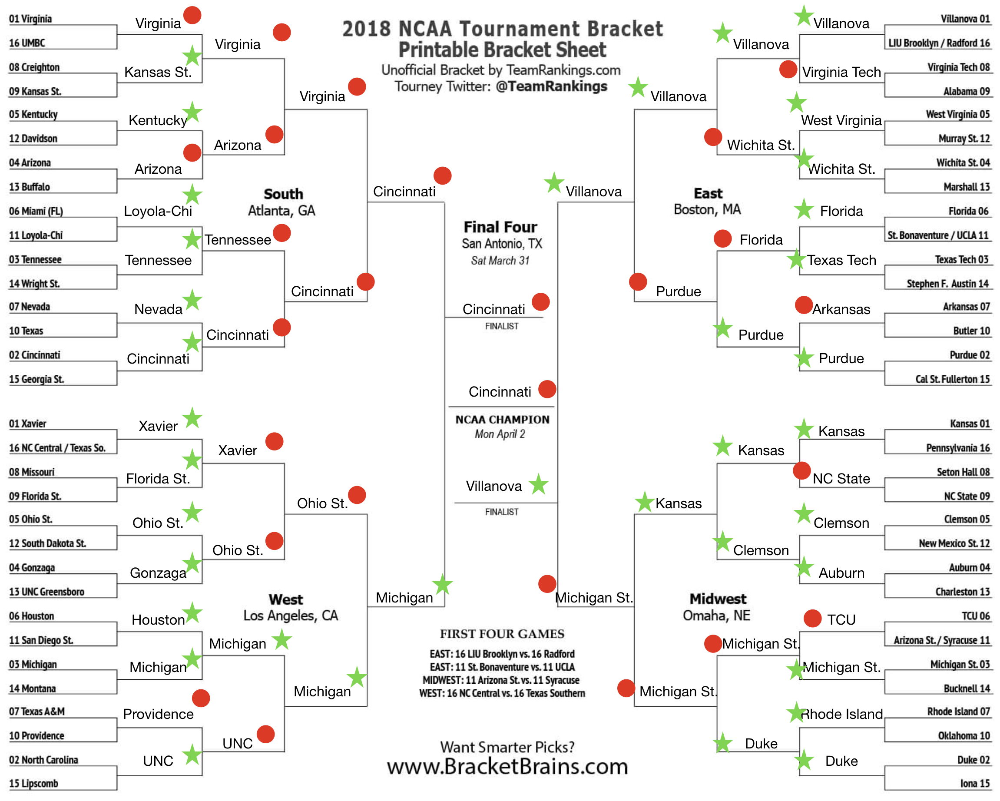

# Bracket Buster


## Table of Contents
1. [Dataset](#dataset)
    * [Pre-Processing](#Pre-processing)
3. [Modeling](#Modeling)
4. [Pick a winner](#Pick-a-winner-feature)
5. [Brackets](#Brackets)
    * [2016 Bracket](#2016-Bracket)
    * [2017 Bracket](#2017-Bracket)
6. [Future Update](#Future-Updates)


## Hypothesis
- Using logistic regression I can create a model to predict winners that can build a better bracket than Obama.

## Dataset
Gamelogs for each team from the past 5 years. Retrieved from www.sports-reference.com.


### Pre-processing

[code_link](game_df_creator.py)

Data Cleaning:


  - Pulled gamelog data for all teams from 2014 to 2018
  - The gamelog data was adapted to get a sense for how teams have been playing up to the matchup. The following features were created for predictions:


Additional features were utilized to work with the data.
  - game type column to filter by season and tournament games.
  - unique matchup id by mapping names with formatted names to combine data to one row for each match!


Hard to tell which features are most important based on visual inspection.  So regularization was utilized to determine most useful features for prediction.    

## Modeling

**Logistic Regression**

* LogisticRegression uses Ridge regularization by default and can be switched to Lasso with an argument.  In this case there was not a significant difference between the two.
  * penalty='l2'  -->   Ridge (default)
  * penalty='l1'  -->   Lasso

* Model was trained and tested, using 5-fold cross validation, on data from games from 2014 through 2017 seasons.

```
Accuracy: 0.68 (% predicted correctly)
Precision: 0.67 (predicted positives % correct)
Recall: 0.66 (% of positives predicted correctly)
f1 Score: 0.66 (weighted average of Precision and Recall)
```

* Model was then tested in the games from the 2018 season (hold out set)

```
Accuracy: 0.67 (% predicted correctly)
Precision: 0.66 (predicted positives % correct)
Recall: 0.66 (% of positives predicted correctly)
f1 Score: 0.66 (weighted average of Precision and Recall)
```

**Coefficients**

Ridge and Lasso error rate was identical and looking at the feature coefficients it is not hard to see why.  It is interesting to see that Lasso did not remove any features.  


**C-optimization**

In logistic regression the regularization parameter is `C` and is the inverse of regularization strength (`alpha = 1 / C`).  Therefore, C must be positive with lower values resulting in stronger regularization.

~~~python
model = LogisticRegression(C=1)
~~~


It is strange that with varying regularization that model accuracy did not change.  Without a perceptible change in accuracy with various regularization parameters it was optimized using `GridSearchCV` from sklearn's model selection library.  This showed an optimal regularization parameter of 1 which is the default and results in no regularization.

~~~python
Cs = list(np.linspace(0.1, 3, 100))
grid_search_results = GridSearchCV(model, param_grid={'C':Cs}, scoring='accuracy', cv=5)
grid_search_results.fit(X_train, y_train)
grid_search_results.best_params_
> {'C': 1.0000}
~~~

## Pick-a-winner-feature

An interactive function was created to pit two teams against on another to see the modeled outcome.  A threshold of .5 was used to distinguish a winner from a loser.  

- Using final 2017 season stats for each team the model was trained on games from the previous four years to predict the 2017 bracket.

[Code Link](win_or_lose.py)

A clear winner:
~~~
team1: kansas
team2: iona
kansas wins and iona loses!
kansas has 84% chance to win.
iona has 16% chance to win.
~~~


A close match:
~~~
team1: kansas
team2: north-carolina
kansas wins and north-carolina loses!
kansas has 61% chance to win.
north-carolina has 39% chance to win.
~~~


## Brackets

**Bracket point system:**
- Round 1 (64 teams): 1 point per pick
- Round 2 (32 teams): 2
- Round 3 (16 teams): 4
- Round 4 (8 teams): 8
- Round 5 (Final Four): 16
- Round 6 (Championship): 32

### 2017-Bracket


- ‎sean: 77 points UPDATE!!!
- ‎obama: 67 points UPDATE!!!


### 2018-Bracket

There is always this year!





## Future-Updates
- Additional Features:
  - ‎pace, stats per 100 possessions, team makeup, offensive rating, defensive rating, and home or away
- ‎map all team names back to common formatting
- test model with various rolling average windows
