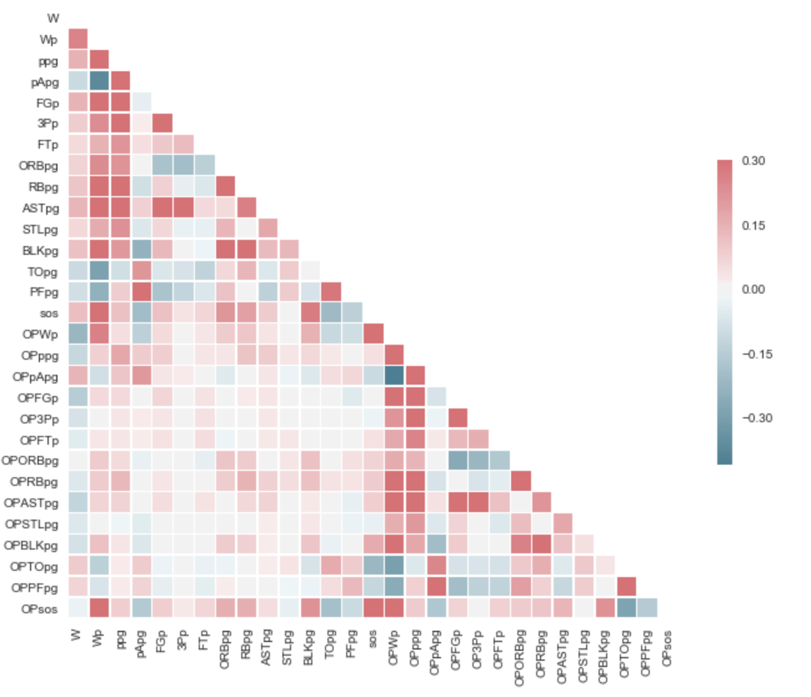

# Bracket Buster


## Table of Contents
1. [Hypotheses](#Hypotheses)
2. [Dataset](#dataset)
3. [Capstone 1](#Capstone_1)
4. [Pre-Processing](#Pre-processing)
5. [Modeling](#Modeling)
6. [Pick a winner](#Pick-a-winner-feature)
7. [Brackets](#Brackets)
8. [Capstone 2](#Capstone_2)
9. [Updates](#Updates)
10. [Additional Data](#Additional_Data)
11. [Clustering](#Clustering)
12. [Team Composition](#Team_Composition)
13. [Packages](#Packages)
14. [Future Update](#Future-Updates)


## Hypotheses
Capstone 1: I can create a model to predict winners that can build a better bracket than Obama.

Result: Yes I can! Logistic Regression outperformed RandomForests and Gradient Decent Boosting.

Capstone 2: Can I improve the predictive capabilities of my model by adding team composition features--using player archetype clustering.

Result: I don't know yet????

## Dataset
Gamelogs, Rosters and player stats per 100 possessions for each team from the past 5 years. Retrieved from www.sports-reference.com.


## Capstone_1:

## Pre-processing

[code_link](game_df_creator.py)

Data Cleaning:


  - Pulled gamelog data for all teams from 2014 to 2018
  - The gamelog data was adapted to get a sense for how teams have been playing up to the matchup. The following features were created for predictions:


Additional features were utilized to work with the data.
  - game type column to filter by season and tournament games.
  - unique matchup id by mapping names with formatted names to combine data to one row for each match!



Hard to tell which features are most important based on visual inspection.  So regularization was utilized to determine most useful features for prediction.    

## Modeling

**Logistic Regression**

* LogisticRegression uses Ridge regularization by default and can be switched to Lasso with an argument.  In this case there was not a significant difference between the two.
  * penalty='l2'  -->   Ridge (default)
  * penalty='l1'  -->   Lasso

* Model was trained and tested, using 5-fold cross validation, on data from games from 2014 through 2017 seasons.

```
Accuracy: 0.68 (% predicted correctly)
Precision: 0.67 (predicted positives % correct)
Recall: 0.66 (% of positives predicted correctly)
f1 Score: 0.66 (weighted average of Precision and Recall)
```

* Model was then tested in the games from the 2018 season (hold out set)

```
Accuracy: 0.67 (% predicted correctly)
Precision: 0.66 (predicted positives % correct)
Recall: 0.66 (% of positives predicted correctly)
f1 Score: 0.66 (weighted average of Precision and Recall)
```

**Coefficients**

Ridge and Lasso error rate was identical and looking at the feature coefficients it is not hard to see why.  It is interesting to see that Lasso did not remove any features.  


**C-optimization**

In logistic regression the regularization parameter is `C` and is the inverse of regularization strength (`alpha = 1 / C`).  Therefore, C must be positive with lower values resulting in stronger regularization.

~~~python
model = LogisticRegression(C=1)
~~~

  ** Update PIC **

Model hyperparameters were optimized using `GridSearchCV` from sklearn's *model selection* library.  This showed an optimal regularization parameter very close to 1--which is the default and results in no regularization.

~~~python
Cs = list(np.linspace(0.1, 3, 100))
grid_search_results = GridSearchCV(model, param_grid={'C':Cs}, scoring='accuracy', cv=5)
grid_search_results.fit(X_train, y_train)
grid_search_results.best_params_
> {'C': 1.17}
~~~

## Pick-a-winner-feature

An interactive function was created to pit two teams against on another to see the modeled outcome.  A threshold of .5 was used to distinguish a winner from a loser.  

- Using final 2017 season stats for each team the model was trained on games from the previous four years to predict the 2017 bracket.

[Code Link](win_or_lose.py)

A clear winner:
~~~
team1: kansas
team2: iona
kansas wins and iona loses!
kansas has 84% chance to win.
iona has 16% chance to win.
~~~


A close match:
~~~
team1: kansas
team2: north-carolina
kansas wins and north-carolina loses!
kansas has 61% chance to win.
north-carolina has 39% chance to win.
~~~


## Brackets

**Bracket point system:**
- Round 1 (64 teams): 1 point per pick
- Round 2 (32 teams): 2
- Round 3 (16 teams): 4
- Round 4 (8 teams): 8
- Round 5 (Final Four): 16
- Round 6 (Championship): 32


### 2018-Bracket


- ‎Model: 81 points
- ‎Obama: 56 points


## Capstone_2:

### Additional_Data

Rosters and player stats per 100 possessions, in addition to game logs, for each team from the past 5 years. Retrieved from www.sports-reference.com.


### Updates

1. SOS per year
2. RandomForests
3. Gradient Descent Boosting

## Clustering

Utilized KMeans Clustering to discover player archetypes based on stats.


hyperparameters:
- kmeans++ - Choose random observations as initial centroids
- n_init = 20 - Number of iterations
  - Remember KMeans is *not deterministic* so we need to run the algorithm multiple times to avoid falling into local minima.


**Choosing K with Silhouette Score:**

<!--  -->

The Silhouette score is calculated by comparing the mean distance between points in a cluster (intra-cluster distance) to the mean distance to the nearest cluster (inter-cluster distance)

$$\frac{(b-a)}{max(a,b)}$$

a = intra-cluster distance
b = inter-cluster distance

Values range from -1 to 1 with 1 being the best and -1 being the worst.
A value of 1 will be compact clusters that are far apart from each other.

Positions Clustered separately with specific features for maximum cluster variance reduction and separation.

Features included for each position:

**Centers:**
'2P', '3P', 'TRB', 'AST', 'STL', 'BLK', 'TOV', 'PTS', 'Height'

**Forwards:**
'2P', '2PA', '3P', '3PA', 'TRB', 'AST', 'STL', 'BLK', 'TOV', 'PTS'

**Guards:**
'3P', 'AST', 'STL', 'TOV', 'PTS', 'TRB'

**Center Archetypes:**
Cluster 0: All Team Center - Strong across the board
Cluster 1: B Team Centers - Weak across the board
Cluster 2: Shooting Center - Score from range

**Center Cluster Representatives:**
Cluster 0 rep: Jock Landale
Cluster 1 rep: JD Wallace
Cluster 2 rep: Thomas Welsh


**Forward Archetypes:**
Cluster 0: Deep Forwards - Drops 3's and feeds
Cluster 1: Versatile Forwards - Defend and Shoot
Cluster 2: Supporting Forwards - Short range game and passing

**Forward Cluster Representatives:**
Cluster 0 rep: Oshae Brissett
Cluster 1 rep: Justin Johnson
Cluster 2 rep: Steffon Mitchell


**Guard Archetypes:**
Cluster 0: All Team Guards - Strong All Around
Cluster 1: Supporting Guards - Set up Team mates
Cluster 2: Utility 3 Point Shooter - Hits Threes Given Opportunity
Cluster 3: B Team Guards - Weak performing starters
Cluster 4: Rebounding Guard - Steals, Rebounds and Shoots Threes
Cluster 5: Utility Thief - Steals and Scores Given Opportunity
Cluster 6: Benchwarmer - Don't take advantage of playtime

Cluster 0 rep: Tyus Battle
Cluster 1 rep: Franklin Howard
Cluster 2 rep: Marquis Godwin
Cluster 3 rep: Jonah Radebaugh
Cluster 4 rep: Jordan Caroline
Cluster 5 rep: L.J. Thorpe
Cluster 6 rep: Leighton Schrand


## Team_Compostition:


## Packages


## Future-Updates
- Add Team Composition features into predictive Model!
- Team Experience Level (% upper class men)
- Team Composition Clusters
  - improve clustering
- Additional Features:
  - ‎pace of play, Other stats that my help with clustering.
- test model with various rolling average windows
- Adapt model to predict point spread
- test different models
  - MLP Neural Net
