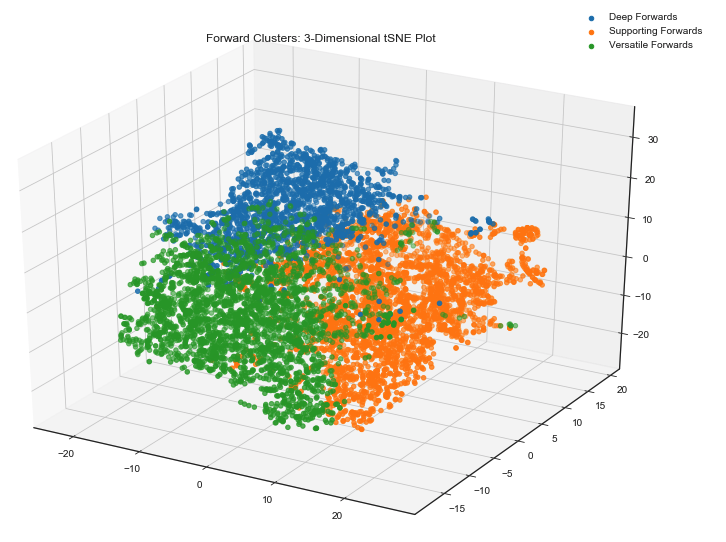
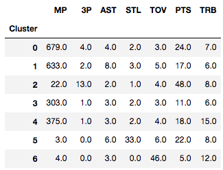

<!-- # Bracket Buster -->

## Table of Contents
1. [Hypotheses](#Hypotheses)
2. [Data](#data)
3. [Feature Engineering](#Feature_Engineering)
4. [Team Composition Clustering](#Team_Composition_Clustering)
5. [Modeling](#Modeling)
6. [Pick a winner](#Pick-a-winner-feature)
7. [Brackets](#Brackets)
8. [Tech Stack](#Tech_Stack)
9. [Future Update](#Future-Updates)
10. [Appendix](#Appendix)

## Hypotheses
Hypothesis 1: Using Gradient Boosting Classification I can create a model to predict winners that can build a better bracket than Obama.

Hypothesis 2: Create team composition features--using player archetype clustering--to improve model accuracy.

## Data
Team game logs, rosters and player stats, per 100 possessions, from the past five seasons. Retrieved from www.sports-reference.com.

[code_link](scraper.py)

Game Logs:


Roster:


Player Stats per 100 Possessions:


## Feature_Engineering

[code_link](game_df_creator.py)

The game log data was adapted to get a sense for how teams have been playing up to the matchup.

The following features were created for predictions:

  not updating...

All team stats were transformed into five-game rolling averages to represent current team performance.  Rolling average windows for team stats, from two to seven games, were tested with five-game resulting in best modeling accuracy.

[code_link](model_dataset_selection.py)

## Team Composition Features with K-Means Clustering

### Player Archetype Clustering with K-Means

K-means is an algorithm that is used to find natural groups in data.  Players who share the same position could have very different play styles.  For example, some centers can fly, dunk and shoot threes while others are just giant trees snatching rebounds.  I used this to find subsets of the standard positions in the hopes that certain team compositions would match up well against others and improve model predictions.  Guards, forwards and centers were broken up into 4, 3 and 3 subgroups respectively.  


hyperparameters:
- kmeans++ - Choose random observations as initial centroids
- n_init = 20 - Number of iterations
  - KMeans is *not deterministic* so we need to run the algorithm multiple times to avoid falling into local minima.

#### Choosing K with Silhouette Score:

The Silhouette score is calculated by comparing the mean distance between points in a cluster (intra-cluster distance) to the mean distance to the nearest cluster (inter-cluster distance)


- A value of 1 will be compact clusters that are far apart from each other.


- K from 2 to 9 clusters were tested for each position.  The K that resulted in maximum silhouette score was used for the number of subgroups for each position.  

Players in each position clustered into subgroups with specific features for maximum cluster variance reduction and separation.  

#### Position Clustering

Features included for each position:

| Position | Features |
|----------|----------|
| Centers | 2-pointers, 3-pointers, Rebounds, Assists, Steals, Blocks, Turn-overs, Points, Height |
| Forwards | 2-pointers, 2-point attempts, 3-pointers, 3-point attempts, Rebounds, Assists, Steals, Blocks, Turn-overs, Points |
| Guards | 3-pointers, Assists, Steals, Turn-overs, Points, Rebounds |

**Center Archetypes:**

| Cluster | Archetype | Description | Representative |
|---------|-----------|-------------|----------------|
| 0 | All Team Center | Strong across the board | Jock Landale |
| 1 | B Team Centers | Weak across the board | JD Wallace |
| 2 | Shooting Center | Score from range | Thomas Welsh |


<!--  -->


**Forward Archetypes:**
Cluster 0: Deep Forwards - Drops 3's and feeds
Cluster 1: Versatile Forwards - Defend and Shoot
Cluster 2: Supporting Forwards - Short range game and passing

| Cluster | Archetype | Description | Representative |
|---------|-----------|-------------|----------------|
| 0 | Deep Forwards | Drops 3's and feeds | Oshae Brissett |
| 1 | Versatile Forwards | Defend and Shoot | Justin Johnson |
| 2 | Supporting Forwards | Short range game and passing | Steffon Mitchell |


<!--  -->


**Guard Archetypes:**

| Cluster | Archetype | Description | Representative |
|---------|-----------|-------------|----------------|
| 0 | All Team Guards | Strong All Around | Tyus Battle |
| 1 | Supporting Guards | Defend and Shoot | Franklin Howard |
| 2 | Utility 3 Point Shooter | Hits Threes off bench | Marquis Godwin |
| 3 | B Team Guards | Weak performing starters | Jonah Radebaugh |
| 4 | Rebounding Guards | Steals, Rebounds and Shoots Threes | Jordan Caroline |
| 5 | Utility Thief | Steals and Scores off bench | L.J. Thorpe |
| 6 | Benchwarmer | Don't take advantage of playtime | Leighton Schrand |


<!--  -->


### Team Composition Features

Player archetypes were normalized by percentage of total minutes played to create a feature for each archetype.  The plots below show guard archetypes in shades of blue, forwards in shades of orange and centers in green.


On the left is the biggest upset of the tournament, and arguably of all time, UMBC a number 16 seed defeated Virginia a number 1 seed and tournament favorite.  UMBC relies heavily on Shooting Forwards where Virginia is all about the guards.

On the right we have the teams in the final four.  We can see Loyola sticks out from the pack being the dark horse of the group.

[code_link](position_cluster.py)

### Matchup Creation

The final step to get the data ready for modeling is to get data merged into one row per matchup.  Here we create a unique ID for each game suing team names and date then count each instance.  There will be two since each team has an entry of that game from their perspective in their game log.  The first and second instances for each game were considered to be the entry for the team and opposing team, respectively, in the matchup and their stats up to that game were split into two dataframes.  These dataframes were then merged on the unique ID resulting in each row as a single game.  

[code_link](matchup_merger.py)

## Modeling

Two models were created using Gradient Boosting Classification--**one with and one without** the team composition features.

These models were optimized using games from 2014 through 2017 (4,471 games) for training and 2018 season games (1,101 games) for testing.  They had resulting test accuracies of 67% and 66%, respectively, with an improvement, albeit a slight one, from the team composition features.

[code_link](model_optimization.py)

The feature importance plot (below) details features as the contribute to the model's predictions.


<!-- partial dependancy plot -->

Trained models were then dumped to pickle files to be read in for improved prediction time.

[code_link](model_dumper.py)


## Pick-a-Winner Functionality and Bracket Creation

An interactive function was created to pit two teams against on another to see the modeled outcome.  The greater probability of victory distinguishes a winner from a loser.  

Using final 2018 season stats for each team the model was trained on games from the previous five years using optimized models to predict the 2018 bracket.


[code_link](win_or_lose_2018.py)

## 2018-March-Madness-Bracket-Results

**Bracket point system:**
| Round | Teams Remaining | Points per pick |
|-------|-----------------|-----------------|
| 1 | 64 | 1 |
| 2 | 32 | 2 |
| 3 | 16 | 4 |
| 4 | 8 | 8 |
| 5 | 4 | 16 |
| 6 | 2 | 32 |


**Results**


The base model outperformed the model with the team composition features on this go around.  The team composition features pushed a couple close games in the wrong direction, in the final four, leading to a different champion for each model.  Picking the overall winner and having at least a couple correct teams in the final four is paramount to a high score.  It is hard to say which model is objectively *better* but each performed well showing promise in my methodology.  

## Tech Stack


# Appendix:
1. [Future Updates](#Future-Updates)
2. [Modeling](#Modeling)
3. [Brackets](#Brackets)


## Future-Updates
- Test on previous tournaments
- Test with per 100 possession data instead of per game data for game logs
- Explore clustering alternatives
  - Alternate group numbers (k’s)
  - Fuzzy Clustering (GMM)
- Deep Learning
  - MLP
- Auto Bracket generation
  - Produce each team’s probability of winning championship
- Predict Point Spread (change to regression)
- Betting algorithm
- Web app
- Auto Update model with Airflow

## Modeling

Multiple models were tested during this process: Logistic Regression, Random Forests, Gradient Boosting, and two and three layer multilayer perceptrons.  All showed similar accuracies when tested on the 2018 season but Gradient Boosting showed the most believable probabilities for victors.  The three-layer MLP performed well too but wasn't used t0 create a bracket.  This functionality remains on the to-do list for now.

### Logistic Regression

* LogisticRegression uses Ridge regularization by default and can be switched to Lasso with an argument.  In this case there was not a significant difference between the two.
  * penalty='l2'  -->   Ridge (default)
  * penalty='l1'  -->   Lasso

* Model was trained and tested, using 5-fold cross validation, on data from games from 2014 through 2017 seasons.

```
Accuracy: 0.68 (% predicted correctly)
Precision: 0.67 (predicted positives % correct)
Recall: 0.66 (% of positives predicted correctly)
f1 Score: 0.66 (weighted average of Precision and Recall)
```

* Model was then tested in the games from the 2018 season (hold out set)

```
Accuracy: 0.67 (% predicted correctly)
Precision: 0.66 (predicted positives % correct)
Recall: 0.66 (% of positives predicted correctly)
f1 Score: 0.66 (weighted average of Precision and Recall)
```

**Coefficients**

Ridge and Lasso error rate was identical and looking at the feature coefficients it is not hard to see why.  It is interesting to see that Lasso did not remove any features.  

<!--  -->

**C-optimization**

In logistic regression the regularization parameter is `C` and is the inverse of regularization strength (`alpha = 1 / C`).  Therefore, C must be positive with lower values resulting in stronger regularization.

~~~python
model = LogisticRegression(C=1)
~~~


Model hyperparameters were optimized using `GridSearchCV` from sklearn's *model selection* library.  This showed an optimal regularization parameter very close to 1--which is the default and results in no regularization.

~~~python
Cs = list(np.linspace(0.1, 3, 100))
grid_search_results = GridSearchCV(model, param_grid={'C':Cs}, scoring='accuracy', cv=5)
grid_search_results.fit(X_train, y_train)
grid_search_results.best_params_
> {'C': 1.17}
~~~

## Brackets


